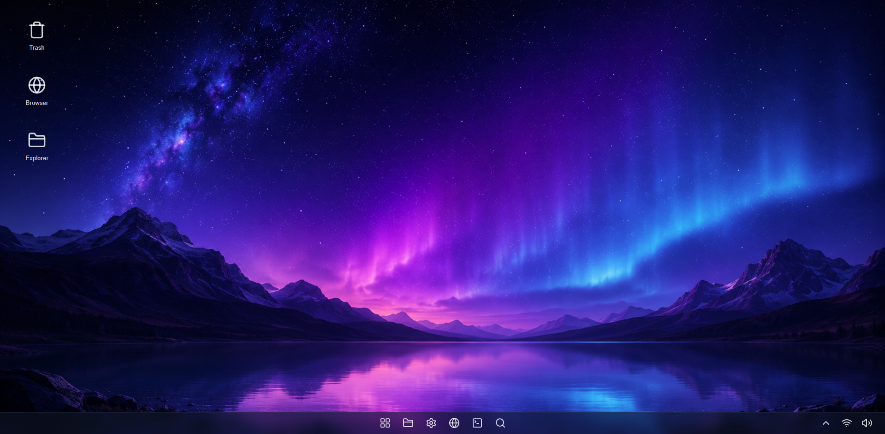

# 🌐 AsterOS

AsterOS is a web-based desktop environment simulation built with vanilla HTML, CSS, and JavaScript.  
The project explores UI/UX concepts inspired by modern operating systems.

---

## 📌 About the Project

AsterOS simulates a desktop-like interface running directly in the browser.  
It focuses on experimenting with layout systems, interface behavior, and user experience design.

This is a frontend-only project with no frameworks or external libraries.

---

## 🧠 Goals

- Improve frontend architecture skills  
- Explore desktop-like web interfaces  
- Practice UI/UX layout design  
- Build a strong portfolio project  

---

## 🛠️ Tech Stack

- HTML5  
- CSS3  
- JavaScript (Vanilla)

---

## 🚀 How to Run

Just open the `index.html` file in any modern browser.

No installation or dependencies required.

---

## 📸 Preview

## 📸 Preview

---

## 📈 Roadmap

- Draggable windows system  
- Taskbar with active applications  
- Context menus (right-click interaction)  
- Smooth animations and transitions  
- Theme system (dark/light mode)

---

## 👨‍💻 Author

Developed by Victor Hugo dos Santos.
